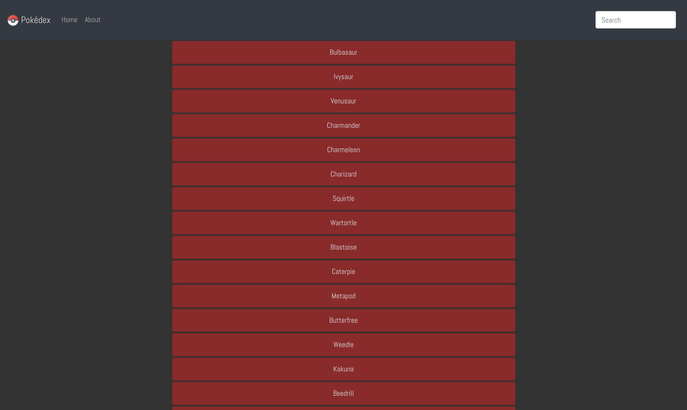
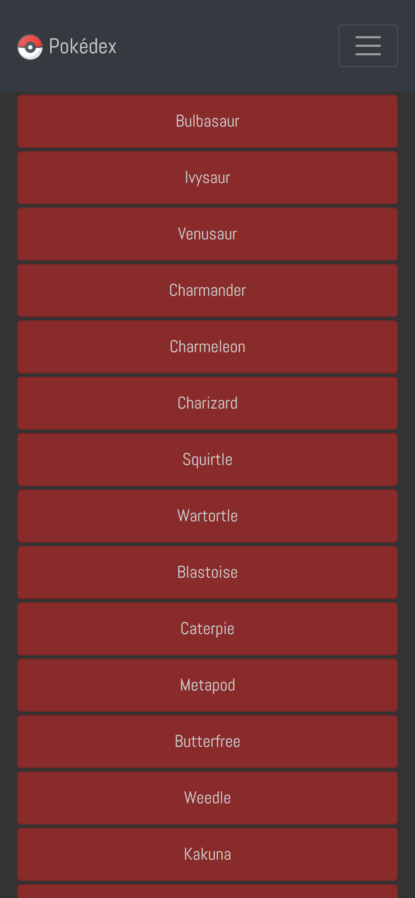
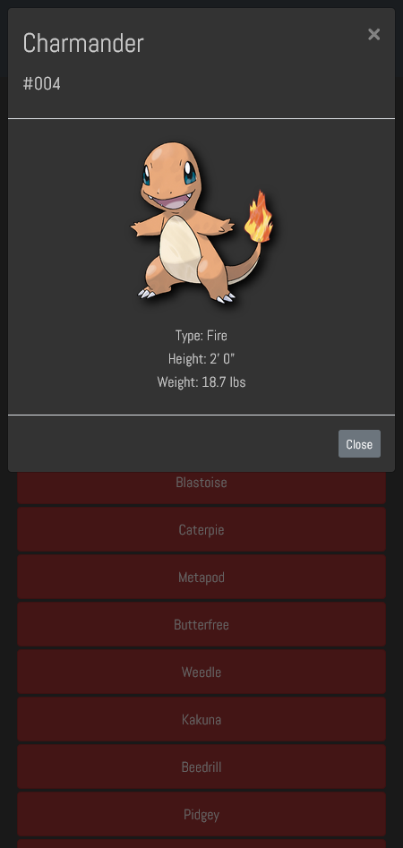

# Pokédex Application

<pre>  </pre>

### Application Link

Live Demo: [Pokédex App](https://mpschirle1.github.io/Pokedex-App/)

## About

This simple Web Application was built with HTML, CSS & JavaScript.
It loads Pokémon data from an external API, and enables the
viewing of data points in detail.

Click on a Pokémon to see more details on that selected Pokémon. Use the search bar to find a specific Pokémon by name.

## Dependencies

- jQuery v3.3.1
- Bootstrap v4.3.1
- Pokémon API - https://pokeapi.co/api/v2/pokemon/

